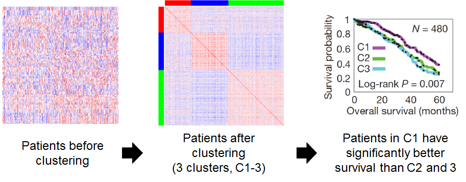
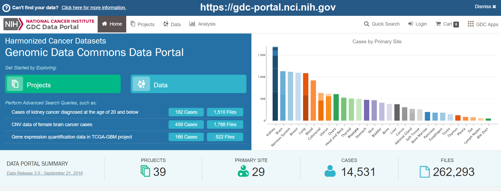
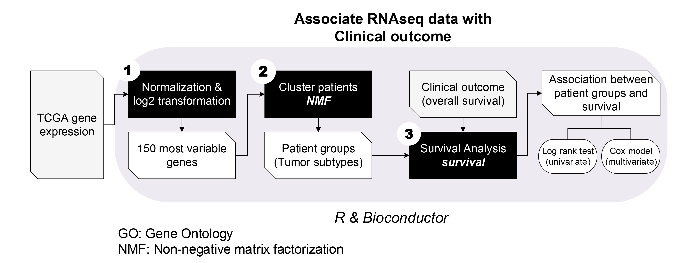
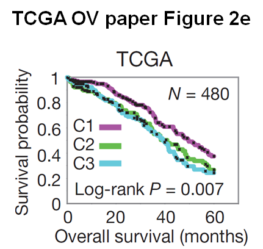
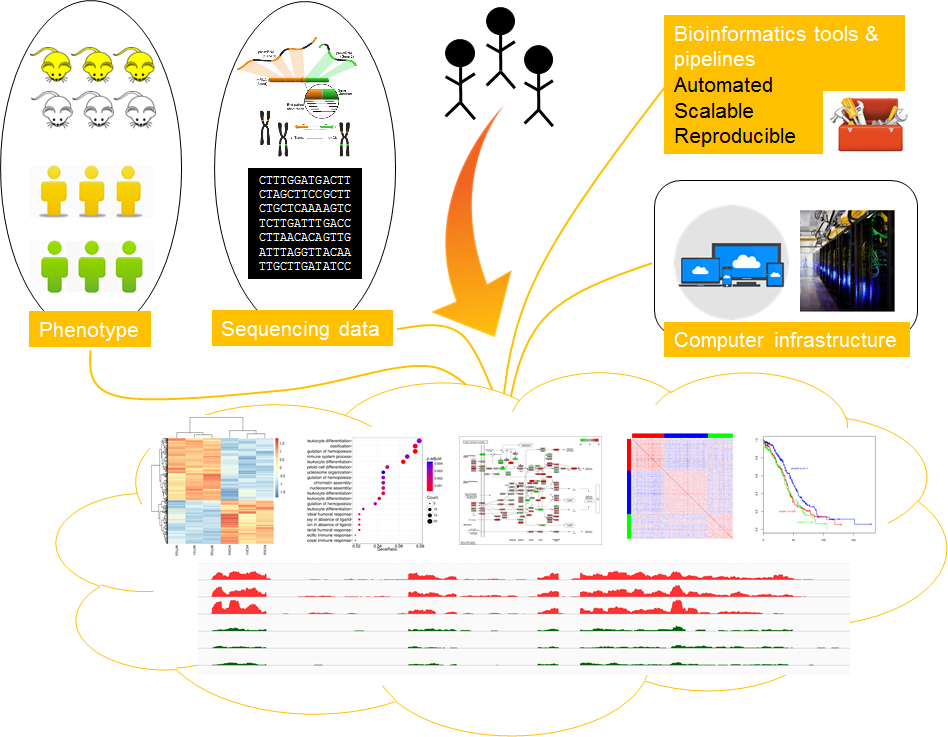

## MSIB32500 Advanced Bioinformatics Spring 2017
## Class 09: RNAseq Data Analysis and Clinical Applications, Part III

**Center for Research Informatics, University of Chicago**

April - June 2017; Saturdays 9:00AM - 12:00PM

**Instructor:** Riyue Bao, Ph.D.

The workshop materials are available on [Github](https://github.com/MScBiomedicalInformatics/MSIB32500) licensed via [LGPLv3](https://www.gnu.org/licenses/lgpl-3.0.en.html).

***

## Objective

* Learn the background and application of The Cancer Genome Atlas (TCGA)
* Learn the structure and access of Genomics Data Commons (GDC)
* Explore datasets hosted on GDC
* Practice how to associate gene expression with clincial data

***

## Dataset

The Cancer Genome Atlas, Ovrian Cancer (TCGA-OV), miRNA gene expression and Clinical data.

* ~600 Ovarian Cancer patients (expression and clinical)
 


***

## Genomic Data Commons (GDC)
    
* Website: https://gdc-portal.nci.nih.gov
* Hosts large-scale multiomics & clinical data (TCGA, TARGET, etc.)
* Powerful GUI for interactive exploration & visualization
* Data access and download
    * [gdc-client](https://gdc.cancer.gov/access-data/gdc-data-transfer-tool)
    * [GDC API tools](https://gdc.cancer.gov/developers/gdc-application-programming-interface-api)
    * [Website download](https://gdc-portal.nci.nih.gov/search/s?facetTab=cases)
    * [TCGAbiolinks](https://bioconductor.org/packages/release/bioc/html/TCGAbiolinks.html) *v2.2.5 or above* (require `R 3.3` or above)



***

## Practice how  to associate gene expression with clincial outcome

### Workflow

The analysis takes 3 major steps. Full-length description & R code is provided in `notebook_ext/03.Run_RNAseq.tutorial.ipynb`.



***

## 1 Getting ready for the analysis 

1.1 Get the handson R markdown & code, as well as data input files from `GitHub`.

```{bash, echo=TRUE, eval=FALSE}
## navigate to your own working directory on your computer
## I will use desktop as my working directory
cd Desktop 

## clone the class git repo
git clone https://github.com/MScBiomedicalInformatics/MSIB32500.git

## check the repo has been downloaded
ls -al MSIB32500/
```

***

1.2 Open `Rstudio` (or `R`) on your local computer. From here, All analysis steps will be conducted in R environment on local computers. 

*** 

1.3 Clean the environment

```{R, echo=TRUE, eval=TRUE}
rm(list=ls())
```

***

1.4 Nevigate to the class lecture directory. We will run analysis in this directory.

```{R, echo=TRUE, eval=TRUE}
## replace [path]C:/Users/rbaoc/Desktop] with your own project directory path
## on windows machines, replace [\] with [/]
# path <- 'C:/Users/rbaoc/Desktop/MSIB32500/lectures'
path <- 'C:/Users/rbaoc/Desktop/Bioinfo_teaching/MSIB32500/lectures'
setwd(path)

## check if the working directory has been successfully set
getwd()

## list files in current directory
list.files(path = '.')
```

***

1.5 Start the clock

```{R, echo=TRUE, eval=TRUE}
ptm <- proc.time()
```

***

1.6 Install libraries / packages

```{R, echo=TRUE, eval=TRUE}
##-- List packages required in this analysis
cpan.pkg.list <- c('ggplot2', 'RColorBrewer', 'reshape', 'broom',
             'gplots', 'survival', 'NMF', 'imager')

##-- Set up CPAN repo (required if running IRkernel in Jupyter)
## if http does not work, try https
cpan.repos <- 'http://cran.us.r-project.org'
```

It is recommended to intall each package one by one to properly diagnosis any error or warning messages.

```{R, echo=TRUE, eval=FALSE}
##-- Install CPAN packages
install.packages('ggplot2') 
install.packages('RColorBrewer')
install.packages('reshape') 
install.packages('gplots') 
install.packages('survival') 
install.packages('NMF') 
install.packages('imager') 
```

***

1.7 Load libraries / packages

```{R, echo=TRUE, eval=TRUE}
##-- Load libraries
for(pkg in c(cpan.pkg.list)) {
    print(pkg)
    suppressMessages(library(pkg, character.only = TRUE))
}
```

## 2. Use gene expression to identify tumor subtypes

**Good coding practice**

* One statement each line for clarity. It is possible to concatenate statements with `;` but not recommended
* Break long statements into multiple lines with less than 80 columns per line for better readability!

*** 

2.1 Set up global parameters, input/output directories and files

* Set up global variables at the beginning, avoid hard-coding of file names, directories, etc.
* Can easily apply to other projects with similar experimental design

```{R, echo=TRUE, eval=TRUE}
separator <- '========================================'

##-- Parameters
cancer <- 'OV' 
gene.top.count <- 150

##-- Set up working directory
work.dir <- '.'
setwd(work.dir)

##-- Input/Output directories
in.dir <- '../cheatsheets/ipynb_data/input'
out.dir <- '../cheatsheets/ipynb_data/output/tcga_ov'

##-- Input/Output files
expr.file <- paste0('TCGA_', cancer, '.mirna_expression.tsv')
clinical.file <- paste0('TCGA_', cancer, '.clinical.tsv')
```

*** 

2.2 Print analysis info

```{R, echo=TRUE, eval=TRUE}
print(paste0('Cancer = ', cancer))
print(paste0('Expression file = ', expr.file))
print(paste0('Clinical file  = ', clinical.file))
```

*** 

2.3 Import data files

* Read counts on coding genes 
* Sample groups

```{R, echo=TRUE, eval=TRUE}
##-- Read files
expr <- read.delim(paste0(in.dir,'/',expr.file), 
                       header = TRUE, stringsAsFactors = FALSE)
clinical <- read.delim(paste0(in.dir,'/',clinical.file), 
                           header = TRUE, stringsAsFactors = FALSE)
clinical <- na.omit(clinical)
print(paste0('Patients with complete clinical = ', nrow(clinical)-1))
print(paste0('Patients with gene expression = ', ncol(expr)-1))
print(paste0('Overlap = ', length(intersect(clinical$sample, 
                                      colnames(expr)))))
print(separator)

print('Show the first three rows of clinical file:')
print(clinical[1:3,])

print(separator)

print('Show the first three rows and left five columns of expression file:')
print(expr[1:3,1:5])
```

*** 

2.4 Preprocess data: Clinical and Expression data

* Select 150 most variable genes for sample clustering
    * Without patient groups known, using all genes for sample clustering is computational intensive and may mask the true differences between potential sample groups
    * The most variable genes likely capture the majority of the sample variation   

```{R, echo=TRUE, eval=TRUE}
##-- Preprocess row.names(clinical) = clinical[,1]
row.names(expr) <- expr[,1]
expr <- as.matrix(expr[,-1])

##-- median-centered normalization by gene (for NMF clustering only!)
expr.centered <- t(apply(expr,1,function(x){x-median(x)}))

##-- calculate variance: MAD
expr.var <- data.frame(mad = apply(expr.centered,1,mad))

##-- sort gene by MAD values (higher to lower) 
expr.var <- expr.var[rev(order(expr.var[,1])),,drop=FALSE]

print(paste0('Calcuate and sort gene by Median absolute deviation (MAD):'))
head(expr.var)

##-- select 150 most variable genes 
expr.var.top <- expr.var[1:gene.top.count,,drop=FALSE]
gene.top <- data.frame(gene = row.names(expr.var.top))

print(paste0('Select top ', gene.top.count,' most variable genes'))
print(expr.var.top[1:6, , drop = FALSE])

##-- subset expression matrix by genes and samples
expr.sub <- expr.centered[row.names(expr.centered) %in% 
                              gene.top$gene,colnames(expr.centered) %in% 
                              clinical$sample]

##-- make clinical samples consistent with expression 
clinical <- clinical[clinical$sample %in% 
                              colnames(expr.sub),]

##-- convert expression matrix to rank matrix (Important for NMF!)
##-- because no negative values are allowed in the matrix
expr.sub <- apply(expr.sub,2,rank) / gene.top.count
```

*** 

2.5 Cluster patients based on expression profiles (NMF)

```{R, echo=TRUE, eval=TRUE}
print(paste0('Expression matrix ready for NMF clustering: ', 
       nrow(expr.sub), ' genes, ', 
       ncol(expr.sub), ' samples'))

print(separator)

##-- run NMF to cluster samples & genes 
##-- (use 4 core 'p4', and print more info 'v')
##-- takes 15 minutes to run... skip in workshop
print('NMF clustering start...')
# expr.sub.nmf <- nmf(expr.sub,
#                    rank = 3,
#                    method = 'brunet',
#                    seed = 'random',
#                    nrun = 100,
#                    .opt = 'vp4')
# save(expr.sub.nmf, file = paste0(out.dir,'/',expr.file,'.nmf.RData'))
##-- in class only: load already generated result
load(paste0(out.dir,'/',expr.file,'.nmf.RData'))
print('Done!')
```

*** 

2.6 Plot sample correlation & gene expression heatmap after clustering

```{R, echo=TRUE, eval=TRUE}
##-- Retrieve sample & gene clusters and add to clinical table
##-- retrieve the basis matrix and coef matrix 
expr.sub.nmf.w <- basis(expr.sub.nmf)
expr.sub.nmf.h <- coef(expr.sub.nmf)

##-- retrieve gene cluster
expr.sub.nmf.geneclr <- predict(expr.sub.nmf, 'features')
expr.sub.nmf.geneclr <- data.frame(gene = row.names(expr.sub.nmf.w), 
                                  cluster = expr.sub.nmf.geneclr)
row.names(expr.sub.nmf.geneclr) <- expr.sub.nmf.geneclr$gene
expr.sub.nmf.geneclr <- expr.sub.nmf.geneclr[
    order(expr.sub.nmf.geneclr$cluster),]

print('Gene clusters ... ')
print(table(expr.sub.nmf.geneclr$cluster))
print(expr.sub.nmf.geneclr[1:3,])

##-- retrieve sample cluster
expr.sub.nmf.smclr <- predict(expr.sub.nmf)
expr.sub.nmf.smclr <- data.frame(sample = colnames(expr.sub.nmf.h), 
                                cluster = expr.sub.nmf.smclr)
row.names(expr.sub.nmf.smclr) <- expr.sub.nmf.smclr$sample
expr.sub.nmf.smclr <- expr.sub.nmf.smclr[
    order(expr.sub.nmf.smclr$cluster),]

print('Sample clusters ... ')
print(table(expr.sub.nmf.smclr$cluster))
print(expr.sub.nmf.smclr[1:3,])

##-- add sample cluster to clinical table
clinical <- merge(clinical, expr.sub.nmf.smclr, by = 'sample')
clinical$cluster <- as.numeric(clinical$cluster)
clinical <- clinical[order(clinical$cluster),]
clinical$cluster <- as.character(clinical$cluster)

##-- Plot sample correlation and gene expression heatmaps
##-- prepare for plotting heatmaps
gene.counts <- data.frame(table(expr.sub.nmf.geneclr$cluster))
gene.colors <- c(rep('pink',gene.counts[1,2]),
                rep('purple',gene.counts[2,2]),
                rep('lightgreen',gene.counts[3,2]))
sample.counts <- data.frame(table(expr.sub.nmf.smclr$cluster))
sample.colors <- c(rep('red',sample.counts[1,2]),
                  rep('blue',sample.counts[2,2]),
                  rep('green',sample.counts[3,2]))

##-- calculate expression correlation between samples
expr.sub.srt <- expr.sub[,clinical$sample]
expr.sub.srt <- expr.sub.srt[row.names(expr.sub.srt) %in% 
                            expr.sub.nmf.geneclr$gene,]
expr.sub.srt <- expr.sub.srt[as.character(expr.sub.nmf.geneclr$gene),]
expr.sub.cor <- cor(expr.sub.srt)

##-- plot sample correlation heatmap
my.heatcol <- bluered(177) 
my.breaks <- sort(unique(c(seq(-1, -0.5, length.out=20),
                          seq(-0.5, 0.5, length.out=140),
                          seq(0.5, 1, length.out=20))))
centered <- t(scale(t(expr.sub.cor), scale=FALSE))
##-- skip in workshop!!
# png(file=paste0(out.dir,'/',expr.file,'.nmf.cor_heatmap.png'), width=800, height=800)
# heatmap <- heatmap.2(centered, 
#                     dendrogram='none', 
#                     Rowv=NULL,
#                     Colv=NULL,
#                     col=my.heatcol, 
#                     RowSideColors=sample.colors, 
#                     ColSideColors=sample.colors, 
#                     density.info='none', 
#                     trace='none', 
#                     key=TRUE, keysize=1.2, 
#                     labRow=FALSE,labCol=FALSE,
#                     xlab='Samples',ylab='Samples',
#                     main = 'Sample correlation heatmap')
# dev.off()

##-- plot gene expression heatmap
my.heatcol <- bluered(177) 
centered <- t(scale(t(expr.sub.srt), scale=FALSE)) 
##-- skip in workshop!!
# png(file=paste0(out.dir,'/',expr.file,'.nmf.gene_heatmap.png'), width=800, height=800)
# heatmap <- heatmap.2(centered, 
#                     dendrogram='none', 
#                     Rowv=NULL,
#                     Colv=NULL,
#                     col=my.heatcol, 
#                     RowSideColors=gene.colors, 
#                     ColSideColors=sample.colors, 
#                     density.info='none', 
#                     trace='none', 
#                     key=TRUE, keysize=1.2, 
#                     labRow=FALSE,labCol=FALSE,
#                     xlab='Samples',ylab='Genes',
#                     main = 'Gene expression heatmap')
# dev.off()

##-- directly view pre-generated heatmaps (class only)
im <- load.image('../cheatsheets/ipynb_data/assets/Figure22.2.png')
plot(im, axes=FALSE, frame.plot=TRUE)

```

*** 

## 3 Survival analysis

Involves two sub-steps in [R](https://www.r-project.org/about.html) (i to ii).

* Identify overall survival (OS) difference between the three tumor subtypes / patient groups
* Kaplan-Meier (KM) plot, log-rank test, and cox proportional hazards model (univariate and multivariate)   

3.1 KM plot and log-rank test

```{R, echo=TRUE, eval=TRUE}
##-- Set up R plot display options in notebook
options(jupyter.plot_mimetypes = "image/svg+xml") 
options(repr.plot.width = 5, repr.plot.height = 5)

##-- add right censoring
table(clinical$vital.status)
clinical$censor <- NA
clinical$censor[which(clinical$vital.status == 'LIVING')] <- 0
clinical$censor[which(clinical$vital.status == 'DECEASED')] <- 1
clinical$censor <- as.numeric(clinical$censor)

##-- KM plot 
surv <- Surv(clinical$overall.survival.day, clinical$censor)
surv.fit <- survfit(surv ~ clinical$cluster)
plot(surv.fit, mark=4, col=c('#00CC00','#0000CC','#CC0000'), 
     lty=1, lwd=1.5,cex=0.8,cex.lab=1.5, cex.axis=1.5, cex.main=1,
     main='Kaplan-Meier survival curves for TCGA OV dataset',
     xlab='Days to Death', 
     ylab='Probability of Survival')
text(1500,0.08,  labels=paste0('cluster1 (n=',sample.counts[1,2],')'), 
     cex=1.2, col='#00CC00')
text(650,0.40, labels=paste0('cluster2\n(n=',sample.counts[2,2],')'), 
     cex=1.2, col='#0000CC')
text(2500,0.68, labels=paste0('cluster3 (n=',sample.counts[3,2],')'), 
     cex=1.2, col='#CC0000')

separator

##-- log-rank test
print(paste0('Running log-rank test for survival'))
surv <- Surv(clinical$overall.survival.day, clinical$censor)
surv.diff <- survdiff(surv ~ clinical$cluster)
surv.diff

separator
```

The KM plot is similar to [TCGA OV paper](http://www.nature.com/nature/journal/v474/n7353/full/nature10166.html) Figure 2e.
*Note that patient cluster C1 in the TCGA OV nature paper corresponds to C3 in our analysis!*



*** 

3.2 Cox multi- and univariant model

```{R, echo=TRUE, eval=TRUE}
##-- cox pp haz model (comparing cluster 2 and 3 as an example!)
print(paste0('Running Cox proportional hazards model for survival'))
clinical.sub <- clinical[clinical$cluster %in% c(1,2,3),]
surv <- Surv(clinical.sub$overall.survival.day, 
            clinical.sub$censor)

print('Cluster 1 will be set as baseline ... ')

separator

##-- univariate cox model 
print(paste0('(a) Univariate cox model for survival'))
m1 <- coxph(surv~(clinical.sub$cluster))
tidy(m1)

separator

##-- full cox model
print(paste0('(b) Full multivariate cox model for survival'))
m2 <- coxph(surv~(clinical.sub$cluster + 
                 clinical.sub$age.at.diagnosis.year + 
                 clinical.sub$tumor.grade))
tidy(m2)

separator

##-- reduced cox model
##-- Always use the simplest model with the least necessary amount 
##-- of covariates to minimize overfitting
print(paste0('(c) Reduced multivariate cox model for survival'))
m3 <- coxph(surv~(clinical.sub$cluster + 
                 clinical.sub$age.at.diagnosis.year))
tidy(m3)
```

*** 

## Analysis done!!

Stop the clock!

```{R, echo=TRUE, eval=TRUE}
proc.time() - ptm
```

*** 

Always save sessionInfo from R for reproducible analysis.

```{R, echo=TRUE, eval=TRUE}
print('Program run finished!')

##-- Print analysis environment (for reproducible research)
sessionInfo()
```

***

## Summary<a class="anchor" id="06"></a> <small>[[top](#top)]</small>

In this class, we demonstrated how to run RNAseq analysis to identify DEGs & pathways, and how to use expression data to identify patient groups with different clinical outcomes. We introduced the commonly used bioinformatics tools and good-practice approaches. All the analysis was performed on a HPC or RStudio environment. 

All the class materials will stay open on [GitHub](https://github.com/MScBiomedicalInformatics/MSIB32500) if you want to practice or use the scripts for your own research projects.

Questions? Post on Github or contact Riyue (Sunny) at `rbao AT bsd dot uchicago dot edu`.


***


