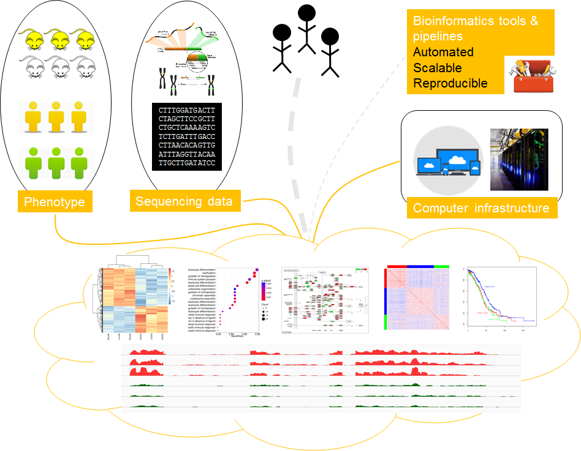
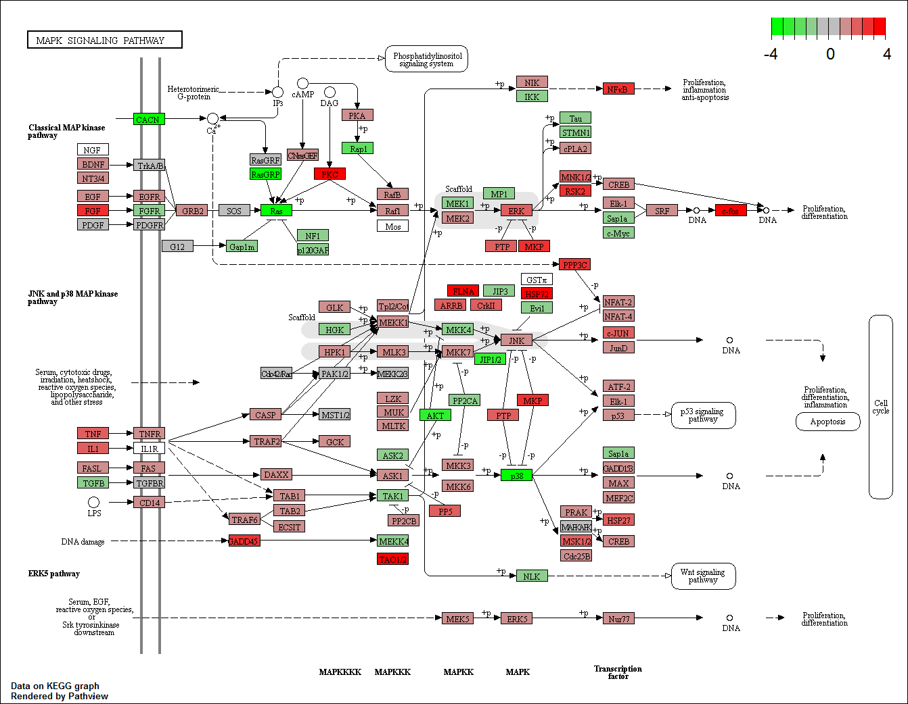

## MSIB32500 Advanced Bioinformatics Fall 2017
## Class 09: RNAseq Data Analysis and Clinical Applications, Part II

**Center for Research Informatics, University of Chicago**

September - December 2017; Saturdays 9:00AM - 12:00PM

**Instructor:** Riyue Bao, Ph.D.

The workshop materials are available on [Github](https://github.com/MScBiomedicalInformatics/MSIB32500) licensed via [LGPLv3](https://www.gnu.org/licenses/lgpl-3.0.en.html).

***

## Objective

* Detect genes differentially expressed between conditions
* Identify pathways / network enriched in genes of interest
* Generate high-quality figures for publication (PCA, heatmap, sample/gene cluster, GO/pathways, etc.)



***

## Dataset
* Two groups (*PRDM11* KO vs WT, human U2932 cells), 6 samples
* Aim to identify DEGs / pathways altered between KO and WT groups

| Sample | Group | Sequencing File | Sequencing Data |
|------|------|------|------|------|   
| KO01 | KO | KO01.fastq.gz | 74,126,025 reads |   
| KO02 | KO | KO02.fastq.gz | 64,695,948 reads |   
| KO03 | KO | KO03.fastq.gz | 52,972,573 reads |   
| WT01 | WT | WT01.fastq.gz | 55,005,729 reads |   
| WT01 | WT | WT02.fastq.gz | 61,079,377 reads |   
| WT01 | WT | WT03.fastq.gz | 66,517,156 reads |  

***

## 1 Getting ready for the analysis 

1.1 Get the handson R markdown & code, as well as data input files from `GitHub`.

```{bash, echo=TRUE, eval=FALSE}
## navigate to your own working directory on your computer
## I will use desktop as my working directory
cd Desktop 

## clone the class git repo
git clone https://github.com/MScBiomedicalInformatics/MSIB32500.git

## check the repo has been downloaded
ls -al MSIB32500/
```

1.2 Open `Rstudio` (or `R`) on your local computer. From here, All analysis steps will be conducted in R environment on local computers. 

*** 

1.3 Clean the environment

```{R, echo=TRUE, eval=TRUE}
rm(list=ls())
```

***

1.4 Nevigate to the class lecture directory. We will run analysis in this directory.

```{R, echo=TRUE, eval=TRUE}
## replace [path]C:/Users/rbaoc/Desktop] with your own project directory path
## on windows machines, replace [\] with [/]
path <- 'C:/Users/rbaoc/Desktop/my_classes/Bioinfo_teaching/fall2017/MSIB32500/lectures'
# path <- 'C:/Users/rbaoc/Desktop/MSIB32500/lectures'
setwd(path)

## check if the working directory has been successfully set
getwd()

## list files in current directory
list.files(path = '.')
```

1.5 Start the clock

```{R, echo=TRUE, eval=TRUE}
ptm <- proc.time()
```

***

1.6 Install libraries / packages

```{R, echo=TRUE, eval=TRUE}
##-- List packages required in this analysis
cpan.pkg.list <- c('ggplot2', 'ape', 'scales', 'RColorBrewer', 
                  'reshape','VennDiagram')
bioc.pkg.list <- c('ctc',  'limma', 'edgeR', 'DESeq2', 'vsn', 
                  'genefilter', 'pheatmap', 
                  'clusterProfiler', 'pathview',
                  'AnnotationHub')

##-- Set up CPAN repo (required if running IRkernel in Jupyter)
cpan.repos <- 'http://cran.us.r-project.org'
```

It is recommended to intall each package one by one to properly diagnosis any error or warning messages.

```{R, echo=TRUE, eval=FALSE}
##-- Install CPAN packages
install.packages('ggplot2') 
install.packages('scales') 
install.packages('ape') 
install.packages('RColorBrewer')
install.packages('reshape') 
install.packages('VennDiagram') 

##-- Set up Bioconductor repo
source("https://bioconductor.org/biocLite.R")

##-- Install Bioc packages
biocLite('ctc')
biocLite('limma')
biocLite('edgeR')
biocLite('DESeq2')
biocLite('vsn')
biocLite('genefilter')
biocLite('pheatmap')
biocLite('clusterProfiler')
biocLite('pathview')
biocLite('AnnotationHub')

```

***

1.7 Load libraries / packages

```{R, echo=TRUE, eval=TRUE}
##-- Load libraries
for(pkg in c(cpan.pkg.list, bioc.pkg.list)) {
    print(pkg)
    suppressMessages(library(pkg, character.only = TRUE))
}

##-- replace Hs with other (e.g. Mm) if you work on other species
##-- annotation database used by clusterProfiler
# suppressMessages(library(org.Hs.eg.db))
```

## 2. Normalize gene expression and identify DEGs: DESeq2

Involves five sub-steps in [R](https://www.r-project.org/about.html) (i to v).

**To systematically identify significant DEGs across the transcriptome, we will use [DESeq2](http://bioconductor.org/packages/release/bioc/html/DESeq2.html)**

* Different tools (`edgeR`, `limmavoom`) may generate different results! [Seyednasrollah F et al. 2015](https://dx.doi.org/10.1093/bib/bbt086)
* We will also practice how to generate publication-quality figures such as PCA, heatmap, clustering, and pathways from our data

**Good coding practice**

* One statement each line for clarity. It is possible to concatenate statements with `;` but not recommended
* Break long statements into multiple lines with less than 80 columns per line for better readability!

*** 

2.1 Set up global parameters, input/output directories and files

* Set up global variables at the beginning, avoid hard-coding of file names, directories, etc.
* Can easily apply to other projects with similar experimental design

```{R, echo=TRUE, eval=TRUE}
##-- Parameters
cancer <- 'DLBC' 
fdr <- 0.05
fc <- 1.5
gene.type <- 'coding'
caller <- 'deseq2'
group1 <- 'KO'
group2 <- 'WT'
colors <- c('#CC0000', '#00CC00')

##-- Set up working directory
work.dir <- '.'
setwd(work.dir)

##-- Input/Output directories
in.dir <- '../cheatsheets/ipynb_data/input'
out.dir <- '../cheatsheets/ipynb_data/output'

##-- Input/Output files
expr.file <- paste0(cancer, '.raw_counts.tsv')
sample.file <- paste0(cancer, '.sample_group.tsv')
geneinfo.file <- 'gencode.v24.primary_assembly.annotation.gtf.geneinfo'
```

*** 

2.2 Print analysis info

```{R, echo=TRUE, eval=TRUE}
print(paste0('Cancer = ', cancer))
print(paste0('gene type = ', gene.type))
print(paste0('DEG fdr cutoff = ', fdr))
print(paste0('DEG fc cutoff = ', fc))
print(paste0('Expression file = ', expr.file))
print(paste0('Sample group file  = ', sample.file))
print(paste0('Gene info file  = ', geneinfo.file))
```

*** 

2.3 Import data files

* Read counts on coding genes 
* Sample groups

```{R, echo=TRUE, eval=TRUE}
##-- Read data files 
data.expr <- read.delim(paste0(in.dir, '/', expr.file),
                       header = TRUE, stringsAsFactors=FALSE)
data.sample <- read.delim(paste0(in.dir, '/', sample.file),
                         header = TRUE, stringsAsFactors=FALSE)
data.geneinfo <- read.delim(paste0(in.dir, '/', geneinfo.file), 
                           header = TRUE, stringsAsFactors = FALSE)
```

*** 

2.4 Peek into imported data

```{R, echo=TRUE, eval=TRUE}
##-- Expression matrix: raw read counts
print(paste0('Expression matrix = ', 
             nrow(data.expr), ' genes, ', 
             ncol(data.expr), ' fields'))
data.expr[1:3,]

##-- Sample table: experimental design & groups
print(paste0('Sample table = ', 
             nrow(data.sample), ' samples, ', 
             length(table(data.sample$Group)), ' groups'))
data.sample

##-- Gene annotation 
print(paste0('Gene annotation = ', 
             nrow(data.geneinfo), ' genes, ', 
             ncol(data.geneinfo), ' fields'))
head(data.geneinfo)
```

*** 

2.5 Preprocess data: Expression matrix, Gene annotation

```{R, echo=TRUE, eval=TRUE}
data.expr.proc <- data.expr
data.sample.proc <- data.sample
data.geneinfo.proc <- data.geneinfo

##-- Set up row names of each data frame
row.names(data.expr.proc) <- data.expr.proc[,1]
row.names(data.sample.proc) <- data.sample.proc[,1]
row.names(data.geneinfo.proc) <- data.geneinfo.proc[,1]

##-- Expression matrix: remove extra columns 
# colnames(data.expr.proc)
data.expr.proc <- data.expr.proc[,c(1,7:12)]
colnames(data.expr.proc)[1] <- 'Gene'

##-- Expression matrix: add gene symbol to Ensembl geneid 
##-- from annotation
print(sum(data.expr.proc$Gene %in% data.geneinfo.proc$gene_id) 
      == nrow(data.expr.proc))
data.expr.proc <- merge(data.geneinfo.proc[,c('gene_id', 
                                             'gene_name')], 
                       data.expr.proc, by = 'row.names')

##-- Expression matrix: concat gene symbol & Ensembl id 
##-- as unique key for each gene row
data.expr.proc$Gene <- paste0(data.expr.proc$gene_name, 
                             '!', data.expr.proc$gene_id)
data.expr.proc <- data.expr.proc[,-c(1:3)]
row.names(data.expr.proc) <- data.expr.proc[,1]
data.expr.proc <- data.expr.proc[,-1]

##-- Expression matrix: peek into preprocessed data
data.expr.proc[1:3,]

##-- Gene annotation: show gene types
data.frame(table(data.geneinfo.proc$gene_type))

##-- Gene annotation: retrieve Ensembl id only
data.geneinfo.proc.gene <- data.geneinfo.proc[,c(1,2,4)]
data.geneinfo.proc.gene <- unique(data.geneinfo.proc.gene)
print(paste0('Total genes = ', nrow(data.geneinfo.proc.gene)))

##-- Gene annotation: concat gene symbol & Ensembl id
##-- as unique key for each gene row
data.geneinfo.proc.gene <- data.frame(Key = 
                    paste0(data.geneinfo.proc.gene$gene_name,'!',
                           data.geneinfo.proc.gene$gene_id), 
                                     data.geneinfo.proc.gene)
row.names(data.geneinfo.proc.gene) <- data.geneinfo.proc.gene[,1]
data.geneinfo.proc <- data.geneinfo.proc[,-1]

##-- Gene annotation: keep two types of genes, 
##-- coding and lincRNA, for further analysis
gene.coding <- data.geneinfo.proc.gene[
    data.geneinfo.proc.gene$gene_type == 'protein_coding',]
gene.lincrna <- data.geneinfo.proc[
    data.geneinfo.proc.gene$gene_type == 'lincRNA',]

##-- Gene annotation: show how many genes are in each list
print(paste0('Coding genes = ', nrow(gene.coding)))
print(paste0('lincRNA genes = ', nrow(gene.lincrna)))
```

*** 

2.6 Proior to DEG identification: Subset expression matrix based on gene type

```{R, echo=TRUE, eval=TRUE}
data.sample.proc.sub <- data.sample.proc

##-- Expression matrix: select gene rows 
##-- based on specified gene type (coding or lincrna)
gene.list <- ''
if(gene.type == 'coding') { gene.list <- gene.coding  }
if(gene.type == 'lincrna') { gene.list <- gene.lincrna }
data.expr.proc.sub <- data.expr.proc[
    row.names(data.expr.proc) %in% row.names(gene.list),] 

##-- Expression matrix: sort matrix sample column 
##-- to be consistent with sample table 
##--(required for DEG analysis)
data.expr.proc.sub <- data.expr.proc.sub[,data.sample.proc.sub$Sample] 

# data.expr = data.expr.proc.sub
# save(data.expr, file = paste0(paste0(out.dir, '/', caller, '/', expr.file, '.coding.Data')))
write.table(data.expr.proc.sub,
           file = paste0(out.dir, '/', caller, '/', expr.file, '.coding.tsv'),
           col.names = TRUE, row.names = TRUE, quote = FALSE, sep = '\t')

print(paste0('Gene list = ', 
             nrow(gene.list), ' (', gene.type, ')'))
print(paste0('Expression matrix before subsetting: ', 
             nrow(data.expr.proc), ' genes'))
print(paste0('Expression matrix after subsetting: ', 
             nrow(data.expr.proc.sub), ' genes'))
```

*** 

2.7 Identify DEGs: DESeq2

```{R, echo=TRUE, eval=TRUE}
out.prefix <- paste0(out.dir, '/', caller, '/',cancer,'.',
                    gene.type, '.', caller)

##-- DESeq2: note data.sample.proc.sub must 
##-- have the same sample column
##-- order as data.expr.proc.sub
Group <- as.factor(data.sample.proc.sub$Group)

##-- DESeq2: covert to matrix data format (previously was data frame)
cds <- as.matrix(data.expr.proc.sub)

##-- DESeq2: build DESeqDataSet object, prepare design matrix
dds <- DESeqDataSetFromMatrix(countData = cds,
                           colData = data.sample.proc.sub, 
                           design = ~ Group)

##-- DESeq2: note this is just simple filter to reduce mem
##-- no affect on DEG results
# dim(dds)
# dds <- dds[ rowSums(counts(dds)) > 0, ]
# dim(dds)

##-- DESeq2: plot estimated dispersions
# pdf(paste0(out.prefix, '.dispersion.pdf'),width = 7, height = 7)
# plotDispEsts(dds, xlim = c(1,10000), ylim = c(1E-10, 1))
# dev.off()

print(dds)
```

*** 

2.8 DESeq2: Normalize and log2-transform count matrix for heatmap, sample clustering, etc. (NOT for DEG identification)

```{R, echo=TRUE, eval=TRUE}
##-- DESeq2: three normalization algrithms (rld, vsd and vsd.fast)
rld <- rlog(dds, blind=FALSE)
vsd <- varianceStabilizingTransformation(dds, blind=FALSE)
# vsd.fast <- vst(dds, blind=FALSE)

##-- DESeq2: peek into normalized expression matrix
head(assay(rld), 3)
head(assay(vsd), 3)

##-- DESeq2: print normalized expression matrix to local files
write.table(data.frame(Gene = row.names(assay(rld)), assay(rld)),
          file = paste0(out.prefix, '.rld.txt'),
          sep = '\t', col.names = TRUE, row.names = FALSE, quote = FALSE)

write.table(data.frame(Gene = row.names(assay(vsd)), assay(vsd)),
          file = paste0(out.prefix, '.vsd.txt'),
          sep = '\t', col.names = TRUE, row.names = FALSE, quote = FALSE)
```

*** 

2.9 DESeq2: plot mean to var to confirm variance shrink works

```{R, echo=TRUE, eval=TRUE}
##-- Set up R plot display options in notebook
options(jupyter.plot_mimetypes = "image/svg+xml") 
options(repr.plot.width = 6, repr.plot.height = 5)

##-- DESeq2: remove genes not expressed in any samples
##-- for plottig purposes
notAllZero <- (rowSums(counts(dds))>0)

##-- DESeq2: mean to var plots 
# pdf(paste0(out.prefix, '.meanvar.log2.pdf'),width = 7, height = 7)
meanSdPlot(log2(counts(estimateSizeFactors(dds),
                       normalized=TRUE)[notAllZero,] + 1))
# dev.off()

# pdf(paste0(out.prefix, '.meanvar.rld.pdf'),width = 7, height = 7)
meanSdPlot(assay(rld[notAllZero,]))
# dev.off()

# pdf(paste0(out.prefix, '.meanvar.vsd.pdf'),width = 7, height = 7)
meanSdPlot(assay(vsd[notAllZero,]))
# dev.off()
```

*** 

2.10 DESeq2: Quality assessment of sample-to-sample relationships (correlation heatmap & PCA)

* Both are good assessment to identify mislabeled samples and outliers
* All genes are used as input!
* PCA - do samples group as expected? 

```{R, echo=TRUE, eval=TRUE}
##-- Set up R plot display options in notebook
options(jupyter.plot_mimetypes = "image/svg+xml") 
options(repr.plot.width = 6, repr.plot.height = 5)

##-- DESeq2: sample correlation heatmap
##-- calculate sample distance 
sampleDists <- dist(t(assay(rld)))
sampleDistMatrix <- as.matrix(sampleDists)
rownames(sampleDistMatrix) <- paste(rld$Group, rld$Libtype, sep="-")
colnames(sampleDistMatrix) <- rownames(sampleDistMatrix)

##-- DESeq2: plot heatmap
heatmap.colors <- rev(cm.colors(32))[1:16]
# pdf(paste0(out.prefix, '.sm_cor.pdf'),width = 7, height = 7)
pheatmap(sampleDistMatrix,
       clustering_distance_rows=sampleDists,
       clustering_distance_cols=sampleDists,
       col=heatmap.colors)
# dev.off()

##-- DESeq2: Principal component analysis (PCA) plot of the samples
##-- use ggplot2 to customize the PCA plot
# pdf(paste0(out.prefix, '.pca.pdf'),width = 7, height = 7)
data.pca <- plotPCA(rld, intgroup=c('Group'), returnData=TRUE)
percent.var <- round(100 * attr(data.pca, "percentVar"))
pca.colors <- c(KO = colors[1], WT = colors[2])
p1 <- ggplot(data.pca, aes(PC1, PC2, color = Group)) +
            geom_point(size = 5, shape = 17) +
            scale_colour_manual(values = pca.colors) + 
            xlab(paste0("PC1: ",percent.var[1],"% variance")) +
            ylab(paste0("PC2: ",percent.var[2],"% variance"))
plot(p1)
```

*** 

2.11 DESeq2: identify DEG between groups

* Normalize read counts across samples
* **Build design matrices for linear modeling**   

| KO | WT |   
|------|------|    
| 1 | 0 |   
| 1 | 0 |   
| 1 | 0 |   
| 0 | 1 |   
| 0 | 1 |   
| 0 | 1 |   

* Fit data to a linear model
* Lowly expressed genes are automatically filtered out (default as mean read counts < 10)
* Estimate the **KO vs WT** fold-change and p-values for each gene 

```{R, echo=TRUE, eval=TRUE}
##-- Set up R plot display options in notebook
options(jupyter.plot_mimetypes = "image/svg+xml") 
options(repr.plot.width = 6, repr.plot.height = 5)

print(paste0('Group 1 = ', group1))
print(paste0('Group 2 = ', group2))

comp <- paste0(group1, 'vs', group2, '.')
out.prefix <- paste0(out.dir, '/', caller,'/',cancer,'.',
                    gene.type, '.',comp,caller,'.txt')

##-- DESeq2: fit the model and identify DEGs
##-- same as running those three steps: 
##-- (1) dds = estimateSizeFactors(dds)
##-- (2) dds = estimateDispersions(dds)
##-- (3) dds = nbinomWaldTest(dds)
dds <- DESeq(dds, test="Wald", betaPrior=TRUE)
res <- results(dds, 
              contrast=c("Group",group1,group2), 
              pAdjustMethod ="fdr", 
              alpha=fdr)

##-- DESeq2: save the result as an R object for reloading
##-- in future analysis
# save(res, file = paste0(out.prefix,'.RData'))

##-- DESeq2: Plot MA to display differential expression 
##-- versus expression strength
# pdf(paste0(out.prefix,'.MAplot.pdf'), width=7, height=7)
plotMA(res, main="DESeq2", ylim=c(-2,2))
# dev.off()

##-- DESeq2: peek into DEG data object
summary(res)
mcols(res)$description
res <- as.data.frame(res)

##-- DESeq2: add fold change (via anti-log log2FC)
res$foldChange <- NA
row.pos <- which(! is.na(res$log2FoldChange) & 
                res$log2FoldChange >= 0)
row.neg <- which(! is.na(res$log2FoldChange) & 
                res$log2FoldChange < 0)
res$foldChange[row.pos] <- 2^res$log2FoldChange[row.pos]
res$foldChange[row.neg] <- -2^((-1) * res$log2FoldChange[row.neg])
res <- data.frame(id = row.names(res), res)
# print(sum(res$foldChange == 0) == 0)

##-- DESeq2: peek into gene list
res[1:3,]

##-- DESeq2: save DEG output into local file
res.ensembl <- gsub('\\S+[!]', '', res[,1], perl = TRUE)
res.symbol <- gsub('[!]\\S+', '', res[,1], perl = TRUE)
res.print <- data.frame(ENSEMBL = res.ensembl,
                       SYMBOL = res.symbol,
                        res[,-c(1:2)])
write.table(res.print,
          file = out.prefix,
          sep = '\t', col.names = TRUE, row.names = FALSE, quote = FALSE)
```

*** 

2.12 DESeq2: Filter for significant DEGs by fold change and fdr

* Filter for significant DEGs with at least 1.5 fold-change and FDR-adjusted p-value < 0.05

```{R, echo=TRUE, eval=TRUE}
##-- Set up R plot display options in notebook
options(jupyter.plot_mimetypes = "image/svg+xml") 
options(repr.plot.width = 6, repr.plot.height = 5)

##-- DESeq2: remove nan values for the foldchange == NAN
before <- nrow(res)
res <- res[!is.na(res$foldChange) & ! is.na(res$padj),];
after <- nrow(res)
print(paste0('Genes removed = ', (before - after), 
             ' (fold change is NA)'))
print(paste0('Genes kept = ', after))

print(paste0('Filter DEGs by: fc, ', fc, ', fdr ', fdr))

##-- DESeq2: plot histogram of unadj p-value for sanity check
# pdf(paste0(out.prefix,'.pvalue.hist.pdf'), width=7, height=7)
hist(res$pval, breaks=100, 
     col="skyblue", border="slateblue", 
     main="Histogram of unadjusted p-value", 
     xlab="unajusted p-value") 
# dev.off()   

##-- DESeq2: filter DEGs
res.flt <- res[(res$foldChange >= fc | res$foldChange <= -fc) & 
              res$padj < fdr,]
print(paste0('Genes filtered = ', (after - nrow(res.flt)), 
             ' (fc, ', fc, ', fdr ', fdr, ')'))
print(paste0('Genes kept = ', nrow(res.flt)))

##-- DESeq2: peek into filtered gene list
res.flt[1:3,]

##-- DESeq2: save filtered DEG output into local file
if(nrow(res.flt) > 0) {
    res.flt.ensembl <- gsub('\\S+[!]', '', res.flt[,1], perl = TRUE)
    res.flt.print <- res.print[res.print$ENSEMBL %in% res.flt.ensembl,]
    write.table(res.flt.print, paste0(out.prefix, 
                                '.flt.fdr', fdr, '_fc', fc), 
                col.names=TRUE, row.names=FALSE, sep='\t', quote=FALSE)
}
```

*** 

2.13 DESeq2: Plot expression heatmap of significant DEGs

* Generate expression heatmap on significant DEGs 

```{R, echo=TRUE, eval=TRUE}
##-- Set up R plot display options in notebook
options(jupyter.plot_mimetypes = "image/svg+xml") 
options(repr.plot.width = 6, repr.plot.height = 5)

##-- DESeq2: continue with significant DEGs from previous step
print(paste0('Genes significant = ', nrow(res.flt), 
             ' (fc, ', fc, ', fdr ', fdr, ')'))

##-- DESeq2: select those sig genes from normalized expression matrix
gene.select <- res.flt$id
data.plot <- assay(rld)
data.plot <- data.plot[row.names(data.plot) %in% gene.select,,
                      drop = FALSE]

##-- DESeq2: prepare annotation label and colors
data.plot.anno <- as.data.frame(
    data.sample.proc.sub[,colnames(data.sample.proc.sub) %in%
                         c('Group'),
                         drop = FALSE])
data.plot.anno.colors <- list(Group = c(KO = colors[1], WT = colors[2]))

##-- DESeq2: plot sig DEG heatmap
print(paste0('Heatmap = ', nrow(data.plot), ' genes on the row, ', 
             ncol(data.plot), ' samples on the column'))
pheatmap(data.plot,
         scale = 'row',
         cluster_rows = TRUE, cluster_cols = TRUE,
         show_rownames = FALSE, show_colnames = TRUE,
         clustering_distance_rows = "euclidean",
         clustering_distance_cols = "euclidean", 
         clustering_method = "complete",
         annotation_row = NA, 
         annotation_col = data.plot.anno,
         annotation_colors = data.plot.anno.colors
        )
```

*** 

## 3. Gene ontology and pathway enrichment analysis: clusterProfiler

* Gene Ontology bological processes and KEGG pathways
* Enrichment in significant DEGs

3.1 Prepare input for GO/KEGG enrichment analysis

```{R, echo=TRUE, eval=TRUE}
##-- clusterProfiler: NOTE those commands were tested for clusterProfiler 
##-- version 3.0.5 or above. Older versions may not work as they have 
##-- options revised/removed in the new versions.

##-- clusterProfiler: prepare input for GO/KEGG enrichment analysis
genes.all <- res.print
genes.sig <- res.flt.print
genes.all$ENSEMBL <- gsub('[.]\\d+', '', genes.all$ENSEMBL, perl = TRUE)
genes.sig$ENSEMBL <- gsub('[.]\\d+', '', genes.sig$ENSEMBL, perl = TRUE)

##-- clusterProfiler: remove genes with fc / pvalue as NA
genes.all <- na.omit(genes.all)

##-- clusterProfiler: add EntrezID
##-- show which keytype is available
keytypes(org.Hs.eg.db) 
genes.all.anno <- bitr(geneID   =  genes.all$ENSEMBL, 
                      fromType = 'ENSEMBL', 
                      toType   = c('ENTREZID', 'SYMBOL'), 
                      OrgDb    = 'org.Hs.eg.db', 
                      drop     = TRUE)

##-- clusterProfiler: save annotated output to local files
write.table(genes.all.anno,
            file = paste0(out.prefix,'.anno'),
            col.names = TRUE, row.names = FALSE, sep = '\t', 
            quote = FALSE)

##-- clusterProfiler: remove genes with duplicate EntrezIDs
genes.all.anno <- genes.all.anno[
    which(! duplicated(genes.all.anno$ENTREZID)), ]
row.names(genes.all.anno) <- genes.all.anno$ENTREZID

##-- clusterProfiler: add fc and p-value to genes.all.anno
genes.all.anno <- merge(genes.all.anno, genes.all, by = 'ENSEMBL')
row.names(genes.all.anno) <- genes.all.anno$ENTREZID

##-- clusterProfiler: prepare significant gene list
genes.sig.anno <- genes.all.anno[genes.all.anno$ENSEMBL %in% 
                                genes.sig$ENSEMBL,]

print(paste0('Genes significant = ', nrow(genes.sig.anno)))
genes.sig.anno[1:3,1:7]

##-- clusterProfiler: prepare input for GSEA 
##-- ranked gene list with decreasing fold change
gene.list <- genes.all.anno$foldChange
names(gene.list) <- genes.all.anno$ENTREZID
gene.list <- sort(gene.list, decreasing = TRUE)
gene.list[1:3]
```

*** 

3.2 GO enrichment analysis

```{R, echo=TRUE, eval=TRUE}
##-- clusterProfiler: GO over-representation test
ego <- enrichGO( gene          = genes.sig.anno$ENTREZID,
                universe      = genes.all.anno$ENTREZID,
                OrgDb         = 'org.Hs.eg.db',
                ont           = "BP",
                pAdjustMethod = "fdr",
                pvalueCutoff  = 0.05,
                readable      = TRUE)
as.data.frame(ego)[1:3,1:7]

##-- clusterProfiler: save GO enrichment output to an R object (faster data import next time!)
save(ego, file = paste0(out.prefix, '.flt.fdr', fdr,'_fc',fc, '.enrichGO.RData'))
```

*** 

3.3 KEGG pathway enrichment analysis

```{R, echo=TRUE, eval=TRUE}
##-- Set up R plot display options in notebook
options(jupyter.plot_mimetypes = "image/svg+xml") 
options(repr.plot.width = 10, repr.plot.height = 5)

##-- clusterProfiler: if running this cell separately, 
##-- load a fresh new copy of ego
load(paste0(out.prefix, '.flt.fdr', fdr,'_fc',fc, '.enrichGO.RData'))

##-- clusterProfiler: enrichGO - drop 5 level of GO terms (too general!)
ego.alllevel <- ego
for(i in 1:5) { 
  ego <- dropGO(ego, level = i)
}

##-- clusterProfiler: visualization of GO enrichment results
p1 <- barplot(ego, showCategory=20)
p2 <- dotplot(ego, showCategory=20)
# p3 = plotGOgraph(ego, firstSigNodes = 10)

##-- clusterProfiler: show the plots in notebook
plot(p1)
plot(p2)
```


```{R, echo=TRUE, eval=TRUE}
##-- clusterProfiler: KEGG over-representation test
kk <- enrichKEGG(gene          = genes.sig.anno$ENTREZID,
                 universe      = genes.all.anno$ENTREZID,
                 organism      = "human",
                 pAdjustMethod = "fdr",
                 pvalueCutoff  = 0.05)
summary(kk)[1:3,]

##-- clusterProfiler: save KEGG pathway enrichment output to an R object (faster data import next time!)
save(kk, file = paste0(out.prefix, '.flt.fdr', fdr,'_fc',fc,'.enrichKEGG.RData'))
```

```{R, echo=TRUE, eval=TRUE}
##-- clusterProfiler: if running this cell separately, load a fresh new copy of kk
load(paste0(out.prefix, '.flt.fdr', fdr,'_fc',fc,'.enrichKEGG.RData'))

##-- clusterProfiler: visualize pathway with all genes
pathway <- 'hsa04010'
plot.title <- paste0(pathway, '.gene_all.pathview.png')
p4 <- pathview(gene.data  = gene.list,
              pathway.id = pathway,
              species    = "human",
              limit      = list(gene=4, cpd=1),
              kegg.dir   = paste0(out.dir,'/',caller),
              out.suffix = paste0('gene_all.pathview'))
```



*** 

## Analysis done!!

Stop the clock!

```{R, echo=TRUE, eval=TRUE}
proc.time() - ptm
```

*** 

Always save sessionInfo from R for reproducible analysis.

```{R, echo=TRUE, eval=TRUE}
print('Program run finished!')

##-- Print analysis environment (for reproducible research)
sessionInfo()
```

***

## 4 Homework (due next Sunday 12/03/2017 at 11:59 PM)

1. Try to filter the DEGs with a more stringent cutoff: 'fdr < 0.01', AND 'fold change (fc) >= 1.5 or <= -1.5'. Note that we want to apply both fdr (<0.01) and fold change filters, and for fold change we filter for genes upregulated (fc>=1.5) or downregulated (fc<=-1.5), then we count all genes that pass these thresholds. How many DEGs are left after filtering?
2. Generate a new gene expression heatmap using significant DEGs from step 1 after applying the new filters. It could be in any format that you choose (e.g. pdf, png, tiff, etc.)
3. (bonus point!) For the heatmap from step 2, instead of using the default blue-red color theme, try to change it to green-red (or other color theme as you like!) and re-generate the heatmap.

The homework will be graded at 0-100 scale and the bonus point will be additional 10.

Please send via Email your R script (preferrable as knitted R markdown HTML or PDF file) and answers to each question as well as plots.

***


